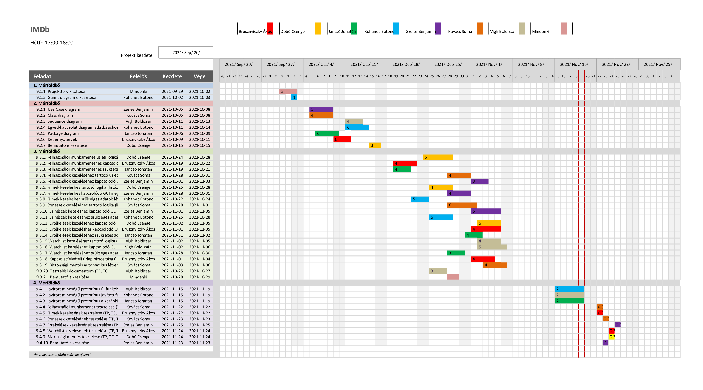

# **IMDB Projektterv 2021**
## **1. Összefoglaló**
Az IMDB lényege, hogy az oldalra látogató felhasználók információt szerezzenek filmekről, színészekről. Aki bejelentkezik az oldalra, kifejtheti véleményét az általa már megtekintett alkotásokról, és értékelheti azokat. Az oldal továbbá watchlist létrehozását is támogatja. Amennyiben van olyan film, ami megtetszett, és a közeljövőben meg szeretnénk nézni, hozzá tudjuk adni a watchlisthez. Mindezen kívül, az oldal rendelkezik egy adminisztratív résszel, melynek segítségével az oldalon megtalálható adatokat, illetve a felhasználókat tudjuk kezelni. Mindezen funkciókat egy letisztult felületen keresztül tudja elérni a felhasználó.
## **2. Verziók**

|**Verzió**|**Szerző(k)**|**Dátum**|**Státusz**|**Megjegyzés**|
| :-: | :-: | :-: | :-: | :-: |
|0.1|Dobó Csenge, Jancsó Jonatán, Brusznyiczky Ákos|2021-09-29|Tervezet|Legelső verzió|
|0.2|Dobó Csenge, Brusznyiczky Ákos, Jancsó Jonatán, Kovács Soma, Szeles Benjámin, Kohanec Botond|2021-10-02|Előterjesztés|A projekt menedzsere jónak találta|
Státusz osztályozás:

- Tervezet: befejezetlen dokumentum, a mérföldkő leadása előtti napokban 
- Előterjesztés: a projekt menedzser bírálatával, a mérföldkő határidejekor 
- Elfogadott: a megrendelő által elfogadva, a prezentáció bemutatásakor 

## **3. A projekt bemutatása**
Ez a projektterv az IMDB projektet mutatja be, mely 2021-09-20-től 2021-11-29-ig tart. A projekt célja, hogy megfelelő felületet biztosítson a filmekkel, illetve színészekkel kapcsolatos adatok kezelésére, nyilvántartására. Mindezért egy egyszerűen használható, átlátható és hatékonyan működő webalkalmazás fog felelni. A projekten hat fő fejlesztő fog dolgozni, az elvégzett feladatokat pedig négy alkalommal fogjuk prezentálni a megrendelőnek.
### **3.1. Rendszerspecifikáció**
A rendszernek képesnek kell lennie arra, hogy a filmekkel, színészekkel kapcsolatos adatokat nyilvántartsa. Amennyiben nincs bejelentkezve az oldalra látogató, csak a színészekkel és filmekkel kapcsolatos információkat tekintheti meg. A bejelentkezett felhasználó hozzá tud szólni, értékelést tud készíteni az adatbázisban szereplő filmekről. Létre tud hozni watchlistet, amihez filmeket tud hozzáadni. A megfelelő jogosultsággal rendelkező bejelentkezett felhasználó (adminisztrátor) képes módosítani az adatbázisban szereplő adatokat.
### **3.2. Funkcionális követelmények**
- Felhasználói munkamenet megvalósítása több jogosultsági szinttel (admin, felhasználó) 
- Regisztráció megvalósítása
- Bejelentkezés megvalósítása
- Felhasználók törlése
- Felhasználók hozzáadása
- Felhasználók moderálása
- Filmek hozzáadása
- Filmek törlése
- Filmek szerkesztése
- Színészek hozzáadása
- Színészek törlése
- Színészek szerkesztése
- Értékelések hozzáadása
- Értékelések törlése
- Értékelések szerkesztése
- Watchlist létrehozása
- Watchilsthez film hozzáadása
- Watchlistről film törlése
- Watchlist szerkesztése
- Keresés filmek között
- Szűrés filmek között
- Biztonsági mentés automatikus létrehozása 

### **3.3. Nem funkcionális követelmények**
- A kliens oldal platform- és böngészőfüggetlen legyen 
- Reszponzív megjelenés 
- Szenzitív adatokat biztonságosan tároljuk 
- A legfrissebb technológiákat használja a rendszer 

## **4. Költség- és erőforrás-szükségletek**
Az erőforrásigényünk összesen kb. 22 személynap/fő.

A rendelkezésünkre áll összesen 7 \* 70 = 490 pont.
## **5. Szervezeti felépítés és felelősség megosztás**
A projekt megrendelője Dr. Pflanzner Tamás. Az IMDB projektet a projektcsapat fogja végrehajtani, amely jelenleg hat fejlesztőből áll. A csapatot pályakezdő webprogramozók alkotják:

- Dobó Csenge 
- Jancsó Jonatán 
- Kovács Soma
- Kohanec Botond
- Szeles Benjámin
- Vigh Boldizsár
- Brusznyiczky Ákos

### **5.1 Projektcsapat**
A projekt a következő emberekből áll:

||**Név**|**E-mail cím (stud-os)**|
| :-: | :-: | :-: |
|Megrendelő|Dr. Pflanzner Tamás|tamas.pflanzner@inf.u-szeged.hu|
|Felelősségek: Projekt menedzser, A rendszer működési logikája, Dokumentáció|Dobó Csenge|h650745@stud.u-szeged.hu|
|Felelősségek: Dokumentáció, Adatbázisok és adatkapcsolatok|Jancsó Jonatán|h983377@stud.u-szeged.hu|
|Projekt tag. Felhasználói felületek, Dokumentáció|Brusznyiczky Ákos|h849085@stud.u-szeged.hu|
|Projekt tag. A rendszer működési logikája, Dokumentáció|Kovács Soma|h983868@stud.u-szeged.hu|
|Projekt tag Felelősségek: Adatbázisok és adatkapcsolatok, Dokumentáció|Kohanec Botond|h983732@stud.u-szeged.hu|
|Felelősségek: Felhasználói felületek, Dokumentáció|Szeles Benjámin|h674785@stud.u-szeged.hu|
|Felelősségek: Felhasználói felületek, Dokumentáció|Vigh Boldizsár|h881224@stud.u-szeged.hu|

## **6. A munka feltételei**
### **6.1. Munkakörnyezet**
A projekt a következő munkaállomásokat fogja használni a munka során:

- Munkaállomások: 7 db PC Windows 10-es operációs rendszerrel 

A projekt a következő technológiákat/szoftvereket fogja használni a munka során: 

- Heroku platformszolgáltatás 
- Heroku által biztosított PostgreSQL adatbázisszerver 
- Spring Boot (backend) 
- Intellij IDEA
- Git verziókövető (GitLab) 

### **6.2. Rizikómenedzsment**

|**Kockázat**|**Leírás**|**Valószínűség**|**Hatás**|
| :-: | :-: | :-: | :-: |
|Betegség/Tag kiesése|Súlyosságtól függően hátráltatja vagy bizonyos esetekben teljes mértékben korlátozza a munkavégzőt, így az egész projektre kihatással van. Megoldás: a feladatok átcsoportosítása|nagy|erős|
|Kommunikációs fennakadás a csapattagokkal|A csapattagok között nem elégséges az információ áramlás, nem pontosan, esetleg késve vagy nem egyértelműen tájékoztatjuk egymást. Megoldás: még gyakoribb megbeszélések és ellenőrzések, legalább 2 nappal a megbeszélés előtt történő időpont egyeztetés|közepes|erős|

## **7. Jelentések**
### **7.1. Munka menedzsment**
A munkát Dobó Csenge koordinálja. Fő feladata, hogy folyamatosan egyeztessen a csapattagokkal az előrehaladásról és a fellépő problémákról, esetlegesen a megoldásban is segítséget nyújhat a projekt csúszásának elkerülése végett. További feladata a heti szinten tartandó csoportgyűlések időpontjának és helyszínének leszervezése, erről a Discord szerveren tájékoztatja a csapatot.
### **7.2. Csoportgyűlések**
A projekt hetente ülésezik, hogy megvitassák az azt megelőző hét problémáit, illetve hogy megbeszéljék a következő hét feladatait. A megbeszélésről minden esetben memó készül.

\1. megbeszélés:

- Időpont: 2021.09.29. 
- Hely: online
- Résztvevők: Dobó Csenge, Jancsó Jonatán, Brusznyiczky Ákos 
- Érintett témák: Ismerkedés, projektterv átbeszélése

\2. megbeszélés:

- Időpont: 2021.10.02. 
- Hely: online
- Résztvevők: Dobó Csenge, Brusznyiczky Ákos, Jancsó Jonatán, Kovács Soma, Szeles Benjámin, Kohanec Botond
- Érintett témák:  projektterv átbeszélése, feladatok kiosztása, projektterv véglegesítése

\3. Megbeszélés:

- Időpont: 2021.10.08. 
- Hely: online
- Résztvevők: Dobó Csenge, Brusznyiczky Ákos, Jancsó Jonatán, Kovács Soma, Szeles Benjámin, Kohanec Botond
- Érintett témák: projektterv átbeszélése, 2. mérföldkőhöz tartozó feladatok átbeszélése

\4. Megbeszélés:

- Időpont: 2021.10.13. 
- Hely: online
- Résztvevők: Dobó Csenge, Brusznyiczky Ákos, Jancsó Jonatán, Kohanec Botond, Vigh Boldizsár
- Érintett témák: 2. mérföldkőhöz tartozó feladatok átbeszélése

\5. Megbeszélés:

- Időpont: 2021.10.15. 
- Hely: online
- Résztvevők: Brusznyiczky Ákos, Kohanec Botond, Kovács Soma, Szeles Benjámin
- Érintett témák: 2. mérföldkőhöz tartozó feladatok átbeszélése

\6. Megbeszélés:

- Időpont: 2021.10.22. 
- Hely: online
- Résztvevők: Brusznyiczky Ákos, Kohanec Botond, Kovács Soma, Szeles Benjámin, Dobó Csenge, Jancsó Jonatán
- Érintett témák: 2. mérföldkőhöz tartozó feladatok átbeszélése

\7. Megbeszélés:

- Időpont: 2021.10.29. 
- Hely: online
- Résztvevők: Brusznyiczky Ákos, Kohanec Botond, Kovács Soma, Szeles Benjámin, Dobó Csenge, Jancsó Jonatán
- Érintett témák: 3. mérföldkőhöz tartozó feladatok átbeszélése

\8. Megbeszélés:

- Időpont: 2021.11.01. 
- Hely: online
- Résztvevők: Brusznyiczky Ákos, Jancsó Jonatán, Dobó Csenge
- Érintett témák: 3. mérföldkőhöz tartozó feladatok átbeszélése

\9. Megbeszélés:

- Időpont: 2021.11.05. 
- Hely: online
- Résztvevők: Brusznyiczky Ákos, Jancsó Jonatán, Dobó Csenge
- Érintett témák: 3. mérföldkőhöz tartozó feladatok átbeszélése

\10. Megbeszélés:

- Időpont: 2021.11.10. 
- Hely: online
- Résztvevők: Brusznyiczky Ákos, Kohanec Botond, Kovács Soma, Szeles Benjámin, Dobó Csenge, Jancsó Jonatán
- Érintett témák: 3. mérföldkőhöz tartozó feladatok átbeszélése

\11. Megbeszélés:

- Időpont: 2021.11.10. 
- Hely: online
- Résztvevők: Brusznyiczky Ákos, Kohanec Botond, Kovács Soma, Dobó Csenge, Jancsó Jonatán
- Érintett témák: 4. mérföldkőhöz tartozó feladatok átbeszélése

### **7.3. Minőségbiztosítás**
Az elkészült terveket a terveken nem dolgozó csapattársak közül átnézik, hogy megfelel-e a specifikációnak és az egyes diagramtípusok összhangban vannak-e egymással. A meglévő rendszerünk helyes működését a prototípusok bemutatása előtt a tesztelési dokumentumban leírtak végrehajtása alapján ellenőrizzük és összevetjük a specifikációval, hogy az elvárt eredményt kapjuk-e. További tesztelési lehetőségek: unit tesztek írása az egyes modulokhoz vagy a kód közös átnézése (code review) egy, a vizsgált modul programozásában nem résztvevő csapattaggal. Szoftverünk minőségét a végső leadás előtt javítani kell a rendszerünkre lefuttatott kódelemzés során kapott metrikaértékek és szabálysértések figyelembevételével. Az alábbi lehetőségek vannak a szoftver megfelelő minőségének biztosítására:

- Specifikáció és tervek átnézése
- Teszttervek végrehajtása
- Unit tesztek írása
- Kód átnézése

### **7.4. Átadás, eredmények elfogadása**
A projekt eredményeit Dr. Pflanzner Tamás fogja elfogadni. A projektterven változásokat csak Dr. Pflanzner Tamás írásos kérés esetén Dr. Pflanzner Tamás engedélyével lehet tenni. A projekt eredményesnek bizonyul, ha specifikáció helyes és határidőn belül készül el. Az esetleges késések pontlevonást eredményeznek. Az elfogadás feltételeire és beadás formájára vonatkozó részletes leírás a következő honlapon olvasható: <https://okt.sed.hu/rf1/>
### **7.5. Státuszjelentés**
Minden leadásnál a projektmenedzser jelentést tesz a projekt haladásáról, és ha szükséges változásokat indítványoz a projektterven. Ezen kívül a megrendelő felszólítására a menedzser 3 munkanapon belül köteles leadni a jelentést. A gyakorlatvezetővel folytatott csapatmegbeszéléseken a megadott sablon alapján emlékeztetőt készít a csapat, amit a következő megbeszélésen áttekintenek és felmérik az eredményeket és teendőket. Továbbá gazdálkodnak az erőforrásokkal és szükség esetén a megrendelővel egyeztetnek a projektterv módosításáról.
## **8. A munka tartalma**
### **8.1. Tervezett szoftverfolyamat modell és architektúra**
A szoftver fejlesztése során az agilis fejlesztési modellt alkalmazzuk. A fejlesztés során nagy hangsúlyt fektetünk a folyamatos kommunikcióra. A fejlesztés során a szoftver specifikációi rugalmasan vátozhatnak, és ezzel a módszertannal tudunk a leggyorsabban alkalmazkodni az új elvárásokhoz.

Programunkat Java-ban és MySQL-ben írjuk, a GUI-t HTML és CSS segítségével valósítjuk meg.
### **8.2. Átadandók és határidők**
A főbb átadandók és határidők a projekt időtartama alatt a következők:

|**Szállítandó**|**Neve**|**Határideje**|
| :-: | :-: | :-: |
|D1|Projektterv és útmutató|2021-10-04|
|P1+D2|UML, DB, képernyőtervek és bemutató|2021-10-18|
|P1+D3|Prototípus I. és bemutató|2021-11-08|
|P2+D4|Prototípus II. és bemutató|2021-11-29|

## **9. Feladatlista**
A következőkben a tervezett feladatok részletes összefoglalása található.
### **9.1. Projektterv (1. mérföldkő)**
Ennek a feladatnak az a célja, hogy megvalósításhoz szükséges lépéseket, az ütemzést és a felelősöket meghatározzuk.

Részfeladatai a következők:
#### **9.1.1. Projektterv kitöltése**
Felelős: Mindenki

Tartam: 3 nap

Erőforrásigény: 2 személynap/fő
#### **9.1.2. Gantt diagram elkészítése**
Felelős: Kohanec Botond

Tartam: 1 nap

Erőforrásigény: 1 személynap
### **9.2. UML és adatbázis tervek (2. mérföldkő)**
Ennek a feladatnak az a célja, hogy a rendszerarchitektúrát, az adatbázist és webalkalmazás kinézetét megtervezzük.

Részfeladatai a következők:
#### **9.2.1. Use Case diagram**
Felelős:  Szeles Benjámin

Tartam: 2 nap

Erőforrásigény: 2 személynap
#### **9.2.2. Class diagram**
Felelős: Kovács Soma

Tartam: 2 nap

Erőforrásigény: 2 személynap
#### **9.2.3. Sequence diagram**
Felelős: Vigh Boldizsár

Tartam: 2 nap

Erőforrásigény: 2 személynap
#### **9.2.4. Egyed-kapcsolat diagram adatbázishoz**
Felelős: Kohanec Botond

Tartam: 2 nap

Erőforrásigény: 2 személynap
#### **9.2.5. Package diagram**
Felelős: Jancsó Jonatán

Tartam: 1 nap

Erőforrásigény: 1 személynap
#### **9.2.6. Képernyőtervek**
Felelős: Brusznyiczky Ákos

Tartam: 3 nap

Erőforrásigény: 3 személynap
#### **9.2.7. Bemutató elkészítése**
Felelős: Dobó Csenge

Tartam: 2 nap

Erőforrásigény: 3 személynap
### **9.3. Prototípus I. (3. mérföldkő)**
Ennek a feladatnak az a célja, hogy egy működő prototípust hozzunk létre, ahol a vállalt funkcionális követelmények nagy része már prezentálható állapotban van.

Részfeladatai a következők:
#### **9.3.1. Felhasználói munkamenet üzleti logikája több jogosultsági szinttel (admin, felhasználó)** 
Felelős: Dobó Csenge

Tartam: 5 nap

Erőforrásigény: 6 személynap
#### **9.3.2. Felhasználói munkamenethez kapcsolódó GUI megvalósítása** 
Felelős: Brusznyiczky Ákos

Tartam: 4 nap

Erőforrásigény: 4 személynap
#### **9.3.3. Felhasználói munkamenethez szükséges adatok létrehozása az adatbázisban** 
Felelős: Jancsó Jonatán

Tartam: 3 nap

Erőforrásigény: 4 személynap
#### **9.3.4. Felhasználók kezeléséhez tartozó üzleti logika (listázása, módosítása, létrehozása, törlése)** 
Felelős: Kovács Soma

Tartam: 4 nap

Erőforrásigény: 4 személynap
#### **9.3.5. Felhasználók kezeléséhez kapcsolódó GUI megvalósítása** 
Felelős: Szeles Benjámin

Tartam: 3 nap

Erőforrásigény: 3 személynap
#### **9.3.6. Filmek kezeléshez tartozó logika (listázása, módosítása, létrehozása, törlése)** 
Felelős: Dobó Csenge

Tartam: 4 nap

Erőforrásigény: 4 személynap
#### **9.3.7. Filmek kezeléshez kapcsolódó GUI megvalósítása** 
Felelős: Szeles Benjámin

Tartam: 4 nap

Erőforrásigény: 4 személynap
#### **9.3.8. Filmek kezeléshez szükséges adatok létrehozása az adatbázisban** 
Felelős: Kohanec Botond

Tartam: 3 nap

Erőforrásigény: 5 személynap
#### **9.3.9. Színészek kezeléséhez tartozó logika (listázása, módosítása, létrehozása, törlése)** 
Felelős: Dobó Csenge

Tartam: 4 nap

Erőforrásigény: 5 személynap
#### **9.3.10. Színészek kezeléshez kapcsolódó GUI megvalósítása** 
Felelős: Szeles Benjámin

Tartam: 5 nap

Erőforrásigény: 5 személynap
#### **9.3.11. Színészek kezeléséhez szükséges adatok létrehozása az adatbázisban** 
Felelős: Kohanec Botond

Tartam: 3 nap

Erőforrásigény: 5 személynap
#### **9.3.12. Értékelések kezeléséhez kapcsolódó logika (listázása, módosítása, létrehozása, törlése)** 
Felelős: Kovács Soma

Tartam: 5 nap

Erőforrásigény: 6 személynap
#### **9.3.13. Értékelések kezeléshez kapcsolódó GUI megvalósítása** 
Felelős: Brusznyiczky Ákos

Tartam: 5 nap

Erőforrásigény: 4 személynap
#### **9.3.14. Értékelések kezeléséhez szükséges adatok létrehozása az adatbázisban** 
Felelős: Jancsó Jonatán

Tartam: 3 nap

Erőforrásigény: 4 személynap
#### **9.3.15.Watchlist kezeléséhez tartozó logika (listázása, módosítása, létrehozása, törlése)** 
Felelős: Vigh Boldizsár

Tartam: 4 nap

Erőforrásigény: 4 személynap
#### **9.3.16. Watchlist kezeléshez kapcsolódó GUI megvalósítása** 
Felelős: Vigh Boldizsár

Tartam: 5 nap

Erőforrásigény: 5 személynap
#### **9.3.17. Watchlist kezeléséhez szükséges adatok létrehozása az adatbázisban** 
Felelős: Jancsó Jonatán

Tartam: 3 nap

Erőforrásigény: 3 személynap
#### **9.3.18. A főoldalhoz tartozó GUI elkészítése**
Felelős: Brusznyiczky Ákos

Tartam: 4 nap

Erőforrásigény: 4 személynap
#### **9.3.19. Biztonsági mentés automatikus létrehozása** 
Felelős: Kovács Soma

Tartam: 4 nap

Erőforrásigény: 4 személynap
#### **9.3.20. Tesztelési dokumentum (TP, TC)**
Felelős: Vigh Boldizsár

Tartam: 3 nap

Erőforrásigény: 3 személynap
#### **9.3.21. Bemutató elkészítése**
Felelős: Mindenki

Tartam: 2 nap

Erőforrásigény: 1 személynap/fő
### **9.4. Prototípus II. (4. mérföldkő)**
Ennek a feladatnak az a célja, hogy az előző mérföldkő hiányzó funkcióit pótoljuk, illetve a hibásan működő funkciókat és az esetlegesen felmerülő új funkciókat megvalósítsuk. Továbbá az alkalmazás alapos tesztelése is a mérföldkőben történik.

Részfeladatai a következők:
#### **9.4.1. Javított minőségű prototípus új funkciókkal**
Felelős: Vígh Boldizsár

Tartam: 5 nap

Erőforrásigény: 2 személynap
#### **9.4.2. Javított minőségű prototípus javított funkciókkal**
Felelős: Kohanec Botond

Tartam: 5 nap

Erőforrásigény: 2 személynap
#### **9.4.3. Javított minőségű prototípus a korábbi hiányzó funkciókkal**
Felelős: Jancsó Jonatán

Tartam: 5 nap

Erőforrásigény: 2 személynap
#### **9.4.4. Felhasználók kelezésének tesztelése (TP, TC, TR)** 
Felelős: Kovács Soma

Tartam: 1 nap

Erőforrásigény: 0.3 személynap
#### **9.4.5. Filmek kezelésének tesztelése (TP, TC, TR)** 
Felelős: Brusznyiczky Ákos

Tartam: 1 nap

Erőforrásigény: 0.3 személynap
#### **9.4.6. Színészek kezelésének tesztelése (TP, TC, TR)** 
Felelős: Kovács Soma

Tartam: 1 nap

Erőforrásigény: 0.3 személynap
#### **9.4.7. Értékelések kezelésének tesztelése (TP, TC, TR)** 
Felelős: Szeles Benjámin

Tartam: 1 nap

Erőforrásigény: 0.3 személynap
#### **9.4.8. Watchlist kezelésének tesztelése (TP, TC, TR)** 
Felelős: Brusznyiczky Ákos

Tartam: 1 nap

Erőforrásigény: 0.3 személynap
#### **9.4.9. Felhasználók létrehozásának és bejelentkeztetésének (TP, TC, TR)** 
Felelős: Dobó Csenge

Tartam: 1 nap

Erőforrásigény: 0.3 személynap
#### **9.4.10. Bemutató elkészítése**
Felelős: Szeles Benjámin

Tartam: 1 nap

Erőforrásigény: 1 személynap
## **10. Részletes időbeosztás**

## **11. Projekt költségvetés**
### **11.1. Részletes erőforrásigény (személynap)**

|**Név**|**1. leadás - Projektterv**|**2. leadás - UML és adatbázis**|**3. leadás - Prototípus I.**|**4. leadás - Prototípus II.**|**Összesen**|
| :-: | :-: | :-: | :-: | :-: | :-: |
|Dobó Csenge|2|1|16|0.3|19.3|
|Jancsó Jonatán|2|1|12|2|17|
|Brusznyiczky Ákos|2|3|13|0.6|18.6|
|Kovács Soma|2|2|15|0.6|19.6|
|Kohanec Botond|3|2|11|2|18|
|Szeles Benjámin|2|2|13|1.3|19.3|
|Vigh Boldizsár|2|2|14|2|19|
### **11.2. Részletes feladatszámok**

|**Név**|**1. leadás - Projektterv**|**2. leadás - UML és adatbázis**|**3. leadás - Prototípus I.**|**4. leadás - Prototípus II.**|**Összesen**|
| :-: | :-: | :-: | :-: | :-: | :-: |
|Dobó Csenge|1|1|4|1|7|
|Jancsó Jonatán|1|1|4|1|7|
|Brusznyiczky Ákos|1|1|4|2|8|
|Kovács Soma|1|1|4|2|8|
|Kohanec Botond|2|1|3|1|7|
|Szeles Benjámin|1|1|4|2|8|
|Vigh Boldizsár|1|1|4|1|7|
### **11.3. Részletes költségvetés**

|**Név**|**1. leadás - Projektterv**|**2. leadás - UML és adatbázis**|**3. leadás - Prototípus I.**|**4. leadás - Prototípus II.**|**Összesen**|
| :-: | :-: | :-: | :-: | :-: | :-: |
|Maximálisan választható pontszám %-ban|10% (7)|30% (21)|50% (35)|30% (21)|100% (70)|
|Dobó Csenge|7|10|35|18|70|
|Jancsó Jonatán|7|18|24|21|70|
|Brusznyiczky Ákos|7|16|35|12|70|
|Kovács Soma|4|21|30|15|70|
|Kohanec Botond|7|21|21|21|70|
|Szeles Benjámin|4|14|35|17|70|
|Vigh Boldizsár|1|17|32|20|70|
Szeged, 2021-10-03.
